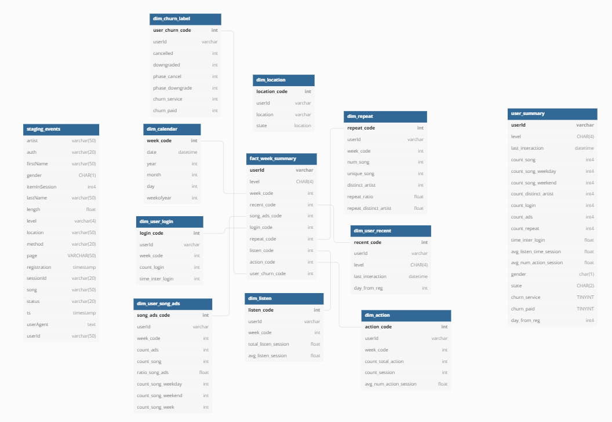
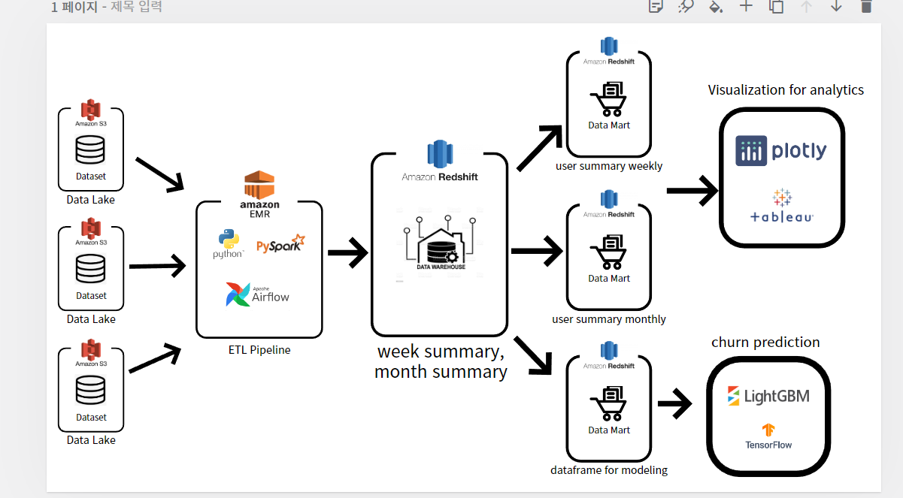

## SPARKIFY CHURN PREDICTION AND ETL PROJECT 

### INTRO 

Using Sparkify dataset, I developped a data pipeline that create 
data lake and data warehouse on AWS S3 and Redshift. 

### Dataset

Sparkify Dataset provided from udacity 

### Data Modeling 

### Data Architecture 

### Setup
1. Python3 must be installed on your env
2. pip install -r requirements.txt

### How To Run
1. Set AWS Access key and secret key on `config.cfg` 
2. Set your s3 bucket which your warehouse table will be stored  on `config.cfg`
3. create Redshift cluster and set redshift cluster configuration on `config.cfg`

4. Run `python ./airflow/dags/etl.py`
6. then, `python ./airflow/dags/copy_redshift.py`